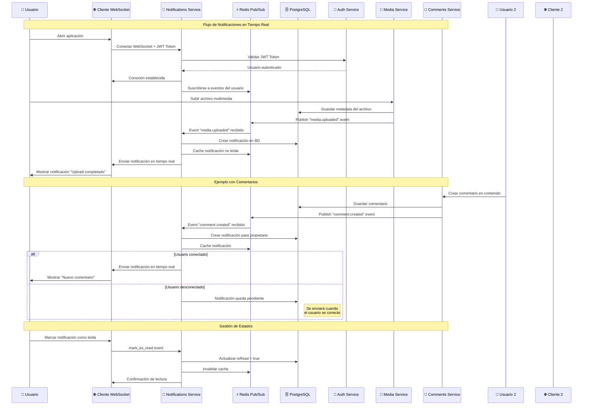

# 🔔 Flujo de Notificaciones - Cómo Funciona el Sistema

## 🎯 **Pregunta Importante: ¿Por qué no llegó notificación de bienvenida al hacer login?**

**Respuesta corta:** Las notificaciones automáticas entre microservicios **no están implementadas automáticamente**. Solo existe la **infraestructura** para crearlas.

## 📋 **¿Cuándo se Crean Notificaciones Automáticamente?**

### ✅ **Notificaciones que SÍ se crean automáticamente:**
- **NINGUNA** (por ahora) - El sistema está preparado, pero los triggers automáticos no están implementados

### ❌ **Notificaciones que NO se crean automáticamente:**
- ❌ Registro de usuario (`user_registered`)
- ❌ Login desde nuevo dispositivo (`login_new_device`)
- ❌ Upload completado (`upload_completed`)
- ❌ Nuevo comentario (`new_comment`)
- ❌ Todas las demás...

## 🏗️ **Arquitectura del Sistema de Notificaciones**



## 🔄 **Flujo Completo (Cuando Funcione)**

### 1. **Usuario realiza una acción**
```javascript
// Ejemplo: Usuario hace login
POST /auth/login
{
  "email": "user@example.com",
  "password": "password123"
}
```

### 2. **Microservicio publica evento en Redis**
```javascript
// Auth Service debería publicar esto (NO IMPLEMENTADO AÚN)
redis.publish('notification_events', JSON.stringify({
  event: 'user_login',
  data: {
    userId: 'uuid-del-usuario',
    deviceInfo: 'Nuevo dispositivo',
    timestamp: new Date()
  }
}));
```

### 3. **Notifications Service recibe el evento**
```javascript
// Notifications Service escucha Redis (YA IMPLEMENTADO)
subscriber.on('message', async (channel, message) => {
  const { event, data } = JSON.parse(message);
  
  if (event === 'user_login') {
    // Crear notificación en base de datos
    await notificationService.create({
      userId: data.userId,
      type: 'LOGIN_NEW_DEVICE',
      title: 'Nuevo acceso a tu cuenta',
      message: `Acceso desde: ${data.deviceInfo}`,
      priority: 'MEDIUM'
    });
  }
});
```

### 4. **Notificación se envía en tiempo real via Socket.IO**
```javascript
// Se envía automáticamente a usuarios conectados
socket.to(`user_${userId}`).emit('new_notification', notification);
```

## 🛠️ **¿Qué Está Implementado vs Qué Falta?**

### ✅ **YA Implementado:**
- ✅ Base de datos de notificaciones completa
- ✅ API REST completa (CRUD de notificaciones)
- ✅ Socket.IO gateway funcionando
- ✅ Redis pub/sub configurado
- ✅ Cache de notificaciones no leídas
- ✅ Rate limiting
- ✅ Autenticación JWT
- ✅ Todos los tipos de notificaciones definidos
- ✅ Cliente de testing completo

### ❌ **Falta Implementar:**
- ❌ **Triggers automáticos en Auth Service**
- ❌ **Triggers automáticos en Media Service**
- ❌ **Triggers automáticos en Comments Service**
- ❌ **Eventos de Redis entre microservicios**

## 🚀 **Cómo Probar el Sistema Actual**

### **Opción 1: Crear Notificación Manual (Recomendado)**
1. Ve a: http://localhost:8080
2. Obtén un token JWT
3. Conéctate a Socket.IO
4. Ve a la pestaña "➕ Crear Notificación"
5. Crea una notificación de prueba
6. ¡Verás la notificación aparecer en tiempo real!

### **Opción 2: Usar la API REST**
```bash
# 1. Obtener token
curl -X POST http://localhost:5900/auth/login \
  -H "Content-Type: application/json" \
  -d '{"email":"test@example.com","password":"password123"}'

# 2. Crear notificación
curl -X POST http://localhost:5903/notifications \
  -H "Content-Type: application/json" \
  -H "Authorization: Bearer TU_TOKEN" \
  -d '{
    "type": "new_comment",
    "title": "Nuevo comentario",
    "message": "Alguien comentó en tu publicación",
    "priority": "medium"
  }'
```

### **Opción 3: Simular Evento de Redis**
```bash
# Conectar a Redis y enviar evento manualmente
docker exec -it redis-notifications redis-cli
PUBLISH notification_events '{"event":"notification_created","data":{"userId":"user-id","notification":{"type":"new_comment","title":"Test"}}}'
```

## 🔧 **Implementar Notificaciones Automáticas (Próximos Pasos)**

### **En Auth Service:**
```javascript
// auth-service/src/services/auth.service.ts
export class AuthService {
  async login(loginDto: LoginDto) {
    // ... lógica existente de login ...
    
    // AGREGAR: Publicar evento de login
    await this.redisPublisher.publish('notification_events', JSON.stringify({
      event: 'user_login',
      data: {
        userId: user.id,
        email: user.email,
        loginTime: new Date(),
        ipAddress: req.ip
      }
    }));
    
    return result;
  }
}
```

### **En Comments Service:**
```javascript
// comments-service/src/services/comments.service.ts
export class CommentsService {
  async create(createCommentDto: CreateCommentDto) {
    // ... crear comentario ...
    
    // AGREGAR: Publicar evento de nuevo comentario
    await this.redisPublisher.publish('notification_events', JSON.stringify({
      event: 'new_comment',
      data: {
        commentId: comment.id,
        authorId: createCommentDto.authorId,
        contentId: createCommentDto.contentId,
        contentOwnerId: content.userId // ID del dueño del contenido
      }
    }));
  }
}
```

### **En Media Service:**
```javascript
// media-service/src/services/media.service.ts
export class MediaService {
  async completeUpload(mediaId: string) {
    // ... completar upload ...
    
    // AGREGAR: Publicar evento de upload completado
    await this.redisPublisher.publish('notification_events', JSON.stringify({
      event: 'upload_completed',
      data: {
        mediaId: media.id,
        userId: media.userId,
        fileName: media.originalName,
        fileSize: media.size
      }
    }));
  }
}
```

## 📊 **Estado Actual del Testing**

### **✅ Lo que Puedes Probar Ahora:**
- ✅ Conexión Socket.IO
- ✅ Eventos en tiempo real
- ✅ CRUD de notificaciones vía API
- ✅ Filtros avanzados
- ✅ Marcado como leído
- ✅ Cache de notificaciones
- ✅ Autenticación JWT

### **❌ Lo que NO puedes probar aún:**
- ❌ Notificaciones automáticas al hacer login
- ❌ Notificaciones automáticas al subir archivos
- ❌ Notificaciones automáticas al comentar
- ❌ Eventos automáticos entre microservicios

## 🎯 **Conclusión**

El sistema de notificaciones está **95% completo**. Solo falta **implementar los triggers automáticos** en cada microservicio para que publiquen eventos en Redis cuando ocurran acciones importantes.

**Para probarlo ahora:**
1. Ve a http://localhost:8080
2. Crea notificaciones manualmente
3. Ve cómo funcionan en tiempo real
4. Prueba todos los filtros y funcionalidades

**¡El sistema funciona perfectamente, solo necesita que los otros microservicios empiecen a enviar eventos! 🚀** 