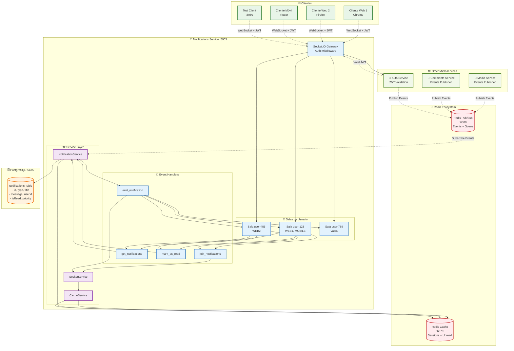

# 🔔 Sistema de Notificaciones

Documentación completa del sistema de notificaciones en tiempo real de la plataforma.

## 📋 Contenido

- [Tipos de Notificaciones](#tipos-de-notificaciones)
- [Diagrama de Arquitectura WebSocket](#diagrama-de-arquitectura-websocket)
- [Configuración de Notificaciones](#configuración-de-notificaciones)
- [Gestión de Estados](#gestión-de-estados)
- [Prioridades](#prioridades)
- [Metadata y Personalización](#metadata-y-personalización)
- [Rate Limiting](#rate-limiting)
- [Cache y Performance](#cache-y-performance)

## 🏗️ Diagrama de Arquitectura WebSocket



## 📨 Tipos de Notificaciones

### 🔐 Autenticación y Usuarios

#### `USER_REGISTERED`
**Descripción**: Notificación de bienvenida al registrarse
```json
{
  "type": "USER_REGISTERED",
  "title": "¡Bienvenido a la plataforma!",
  "message": "Tu cuenta ha sido creada exitosamente. Explora todas las funcionalidades disponibles.",
  "priority": "medium",
  "metadata": {
    "userId": "user-uuid",
    "registrationDate": "2024-01-15T10:30:00.000Z"
  }
}
```

#### `LOGIN_NEW_DEVICE`
**Descripción**: Alerta de login desde nuevo dispositivo
```json
{
  "type": "LOGIN_NEW_DEVICE",
  "title": "Nuevo inicio de sesión detectado",
  "message": "Se ha detectado un inicio de sesión desde un nuevo dispositivo. Si no fuiste tú, cambia tu contraseña inmediatamente.",
  "priority": "high",
  "metadata": {
    "deviceInfo": "Chrome 115.0 - Windows 11",
    "ipAddress": "192.168.1.100",
    "location": "Ciudad, País"
  }
}
```

#### `PASSWORD_CHANGED`
**Descripción**: Confirmación de cambio de contraseña
```json
{
  "type": "PASSWORD_CHANGED",
  "title": "Contraseña actualizada",
  "message": "Tu contraseña ha sido cambiada exitosamente.",
  "priority": "medium",
  "metadata": {
    "changeDate": "2024-01-15T14:20:00.000Z"
  }
}
```

#### `LOGIN_FAILED`
**Descripción**: Intentos fallidos de login
```json
{
  "type": "LOGIN_FAILED",
  "title": "Intento de acceso fallido",
  "message": "Se han detectado múltiples intentos fallidos de acceso a tu cuenta.",
  "priority": "high",
  "metadata": {
    "attempts": 5,
    "lastAttempt": "2024-01-15T15:45:00.000Z",
    "ipAddress": "192.168.1.200"
  }
}
```

#### `PROFILE_UPDATED`
**Descripción**: Perfil de usuario actualizado
```json
{
  "type": "PROFILE_UPDATED",
  "title": "Perfil actualizado",
  "message": "Los datos de tu perfil han sido actualizados correctamente.",
  "priority": "low",
  "metadata": {
    "updatedFields": ["firstName", "lastName"],
    "updateDate": "2024-01-15T16:10:00.000Z"
  }
}
```

### 🎬 Media y Contenido

#### `UPLOAD_COMPLETED`
**Descripción**: Archivo subido exitosamente
```json
{
  "type": "UPLOAD_COMPLETED",
  "title": "Archivo subido exitosamente",
  "message": "Tu archivo 'video_tutorial.mp4' ha sido procesado y está disponible.",
  "priority": "medium",
  "metadata": {
    "mediaId": "media-uuid",
    "fileName": "video_tutorial.mp4",
    "fileSize": 52428800,
    "fileType": "video/mp4",
    "processingTime": "00:02:30"
  }
}
```

#### `UPLOAD_FAILED`
**Descripción**: Error en la subida de archivo
```json
{
  "type": "UPLOAD_FAILED",
  "title": "Error al subir archivo",
  "message": "No se pudo procesar tu archivo 'documento.pdf'. Verifica el formato e intenta nuevamente.",
  "priority": "high",
  "metadata": {
    "fileName": "documento.pdf",
    "errorCode": "INVALID_FORMAT",
    "errorMessage": "Formato de archivo no soportado",
    "retryAllowed": true
  }
}
```

#### `MEDIA_PROCESSED`
**Descripción**: Procesamiento de media completado
```json
{
  "type": "MEDIA_PROCESSED",
  "title": "Procesamiento completado",
  "message": "Tu video ha sido optimizado y está listo para compartir.",
  "priority": "medium",
  "metadata": {
    "mediaId": "media-uuid",
    "originalSize": 104857600,
    "compressedSize": 52428800,
    "compressionRatio": "50%",
    "resolutions": ["720p", "1080p"]
  }
}
```

#### `MEDIA_DELETED`
**Descripción**: Media eliminado
```json
{
  "type": "MEDIA_DELETED",
  "title": "Archivo eliminado",
  "message": "El archivo 'imagen_perfil.jpg' ha sido eliminado permanentemente.",
  "priority": "low",
  "metadata": {
    "mediaId": "media-uuid",
    "fileName": "imagen_perfil.jpg",
    "deletionDate": "2024-01-15T18:00:00.000Z",
    "deletedBy": "user"
  }
}
```

#### `NEW_CONTENT_FOLLOWED`
**Descripción**: Nuevo contenido de usuarios seguidos
```json
{
  "type": "NEW_CONTENT_FOLLOWED",
  "title": "Nuevo contenido disponible",
  "message": "Juan Pérez ha subido un nuevo video: 'Tutorial de NestJS'",
  "priority": "medium",
  "metadata": {
    "authorId": "author-uuid",
    "authorName": "Juan Pérez",
    "contentId": "content-uuid",
    "contentTitle": "Tutorial de NestJS",
    "contentType": "video"
  }
}
```

#### `MEDIA_REPORTED`
**Descripción**: Media reportado por otros usuarios
```json
{
  "type": "MEDIA_REPORTED",
  "title": "Contenido reportado",
  "message": "Tu contenido ha sido reportado y está siendo revisado por nuestro equipo de moderación.",
  "priority": "high",
  "metadata": {
    "mediaId": "media-uuid",
    "reportCount": 3,
    "reportReasons": ["inappropriate", "spam"],
    "reviewStatus": "pending"
  }
}
```

### 💬 Comentarios y Interacciones

#### `NEW_COMMENT`
**Descripción**: Nuevo comentario en tu contenido
```json
{
  "type": "NEW_COMMENT",
  "title": "Nuevo comentario",
  "message": "María García comentó en tu video: '¡Excelente explicación!'",
  "priority": "medium",
  "metadata": {
    "commentId": "comment-uuid",
    "commentContent": "¡Excelente explicación!",
    "authorId": "author-uuid",
    "authorName": "María García",
    "contentId": "content-uuid",
    "contentTitle": "Tutorial de NestJS"
  }
}
```

#### `COMMENT_REPLY`
**Descripción**: Respuesta a tu comentario
```json
{
  "type": "COMMENT_REPLY",
  "title": "Respuesta a tu comentario",
  "message": "Carlos López respondió a tu comentario: 'Totalmente de acuerdo contigo'",
  "priority": "medium",
  "metadata": {
    "replyId": "reply-uuid",
    "replyContent": "Totalmente de acuerdo contigo",
    "authorId": "author-uuid",
    "authorName": "Carlos López",
    "originalCommentId": "comment-uuid",
    "contentId": "content-uuid"
  }
}
```

#### `COMMENT_MODERATED`
**Descripción**: Tu comentario fue moderado
```json
{
  "type": "COMMENT_MODERATED",
  "title": "Comentario moderado",
  "message": "Tu comentario ha sido revisado y aprobado por el equipo de moderación.",
  "priority": "low",
  "metadata": {
    "commentId": "comment-uuid",
    "moderationAction": "approved",
    "moderatorId": "moderator-uuid",
    "moderationReason": "Contenido apropiado",
    "moderationDate": "2024-01-15T20:15:00.000Z"
  }
}
```

#### `COMMENT_APPROVED`
**Descripción**: Comentario aprobado después de revisión
```json
{
  "type": "COMMENT_APPROVED",
  "title": "Comentario aprobado",
  "message": "Tu comentario ha sido aprobado y ya es visible para otros usuarios.",
  "priority": "low",
  "metadata": {
    "commentId": "comment-uuid",
    "approvalDate": "2024-01-15T21:00:00.000Z",
    "contentId": "content-uuid"
  }
}
```

#### `COMMENT_MENTION`
**Descripción**: Mención en un comentario
```json
{
  "type": "COMMENT_MENTION",
  "title": "Te mencionaron",
  "message": "Ana Rodríguez te mencionó en un comentario: '@usuario ¿qué opinas sobre esto?'",
  "priority": "medium",
  "metadata": {
    "commentId": "comment-uuid",
    "mentionedBy": "author-uuid",
    "mentionedByName": "Ana Rodríguez",
    "commentContent": "@usuario ¿qué opinas sobre esto?",
    "contentId": "content-uuid"
  }
}
```

### ⚙️ Sistema y Administración

#### `SYSTEM_MAINTENANCE`
**Descripción**: Mantenimiento programado del sistema
```json
{
  "type": "SYSTEM_MAINTENANCE",
  "title": "Mantenimiento programado",
  "message": "El sistema estará en mantenimiento el 20 de enero de 02:00 a 04:00 AM.",
  "priority": "high",
  "metadata": {
    "maintenanceStart": "2024-01-20T02:00:00.000Z",
    "maintenanceEnd": "2024-01-20T04:00:00.000Z",
    "affectedServices": ["upload", "comments"],
    "reason": "Actualización de seguridad"
  }
}
```

#### `SYSTEM_UPDATE`
**Descripción**: Nuevas actualizaciones disponibles
```json
{
  "type": "SYSTEM_UPDATE",
  "title": "Nueva actualización disponible",
  "message": "Hemos agregado nuevas funcionalidades. Recarga la página para verlas.",
  "priority": "medium",
  "metadata": {
    "version": "1.2.0",
    "features": ["Nuevo editor de comentarios", "Mejoras de performance"],
    "releaseDate": "2024-01-15T00:00:00.000Z"
  }
}
```

#### `USAGE_LIMIT_REACHED`
**Descripción**: Límites de uso alcanzados
```json
{
  "type": "USAGE_LIMIT_REACHED",
  "title": "Límite de almacenamiento alcanzado",
  "message": "Has alcanzado el 90% de tu límite de almacenamiento. Considera eliminar archivos antiguos.",
  "priority": "high",
  "metadata": {
    "limitType": "storage",
    "currentUsage": 90,
    "maxLimit": 100,
    "unit": "percentage",
    "suggestions": ["delete_old_files", "upgrade_plan"]
  }
}
```

## ⚙️ Configuración de Notificaciones

### Estructura Base de Notificación

```typescript
interface Notification {
  id: string;
  type: NotificationType;
  title: string;
  message: string;
  userId: string;
  isRead: boolean;
  priority: 'low' | 'medium' | 'high';
  metadata?: Record<string, any>;
  expiresAt?: Date;
  createdAt: Date;
  updatedAt: Date;
}
```

### Crear Notificación Personalizada

```bash
curl -X POST http://localhost:5903/notifications \
  -H "Content-Type: application/json" \
  -H "Authorization: Bearer YOUR_JWT_TOKEN" \
  -d '{
    "type": "CUSTOM_NOTIFICATION",
    "title": "Título personalizado",
    "message": "Mensaje personalizado para el usuario",
    "priority": "medium",
    "metadata": {
      "customField": "valor personalizado",
      "actionUrl": "/path/to/action",
      "category": "custom"
    },
    "expiresAt": "2024-01-20T00:00:00.000Z"
  }'
```

## 📊 Gestión de Estados

### Estados de Notificación

#### `isRead: false` (No leída)
- **Descripción**: Notificación nueva, no vista por el usuario
- **Comportamiento**: Aparece en contador de no leídas
- **Color**: Azul o destacado en UI

#### `isRead: true` (Leída)
- **Descripción**: Usuario ha visto la notificación
- **Comportamiento**: No cuenta en contador de no leídas
- **Color**: Gris o normal en UI

### Marcar como Leída

#### Una notificación
```bash
curl -X PATCH http://localhost:5903/notifications/NOTIFICATION_ID/mark-read \
  -H "Authorization: Bearer YOUR_JWT_TOKEN"
```

#### Múltiples notificaciones
```bash
curl -X POST http://localhost:5903/notifications/mark-read \
  -H "Content-Type: application/json" \
  -H "Authorization: Bearer YOUR_JWT_TOKEN" \
  -d '{
    "notificationIds": ["id1", "id2", "id3"]
  }'
```

#### Todas las notificaciones
```bash
curl -X POST http://localhost:5903/notifications/mark-all-read \
  -H "Authorization: Bearer YOUR_JWT_TOKEN"
```

## 🎯 Prioridades

### `low` - Prioridad Baja
**Características:**
- Color: Verde o gris
- No requiere acción inmediata
- Puede agruparse con otras notificaciones
- Ejemplos: Perfil actualizado, comentario aprobado

**Configuración:**
```json
{
  "priority": "low",
  "metadata": {
    "groupable": true,
    "autoExpire": true,
    "expiresIn": "7 days"
  }
}
```

### `medium` - Prioridad Media
**Características:**
- Color: Azul o amarillo
- Información importante pero no urgente
- Aparece en notificaciones normales
- Ejemplos: Nuevo comentario, upload completado

**Configuración:**
```json
{
  "priority": "medium",
  "metadata": {
    "showInFeed": true,
    "persistDays": 30
  }
}
```

### `high` - Prioridad Alta
**Características:**
- Color: Rojo o naranja
- Requiere atención inmediata
- Puede mostrar popup o alerta
- Ejemplos: Login sospechoso, contenido reportado

**Configuración:**
```json
{
  "priority": "high",
  "metadata": {
    "showPopup": true,
    "persistent": true,
    "requiresAction": true
  }
}
```

## 🎨 Metadata y Personalización

### Campos Comunes de Metadata

#### Acciones
```json
{
  "metadata": {
    "actions": [
      {
        "type": "button",
        "label": "Ver contenido",
        "url": "/media/abc123",
        "style": "primary"
      },
      {
        "type": "button",
        "label": "Marcar como leída",
        "action": "mark_read",
        "style": "secondary"
      }
    ]
  }
}
```

#### Iconos y Estilos
```json
{
  "metadata": {
    "icon": "upload",
    "color": "#4CAF50",
    "badge": "new",
    "animation": "bounce"
  }
}
```

#### Agrupación
```json
{
  "metadata": {
    "groupKey": "daily_summary",
    "groupTitle": "Resumen diario",
    "groupable": true,
    "groupOrder": 1
  }
}
```

#### Expiración
```json
{
  "metadata": {
    "autoExpire": true,
    "expiresIn": "24h",
    "expirationAction": "delete"
  }
}
```

### Plantillas de Notificación

#### Plantilla de Bienvenida
```typescript
const welcomeTemplate = {
  type: 'USER_REGISTERED',
  title: '¡Bienvenido a {platformName}!',
  message: 'Hola {firstName}, tu cuenta ha sido creada exitosamente.',
  priority: 'medium',
  metadata: {
    template: 'welcome',
    variables: {
      platformName: 'Plataforma Multimedia',
      firstName: '{{user.firstName}}'
    },
    actions: [
      {
        label: 'Explorar funcionalidades',
        url: '/dashboard',
        style: 'primary'
      }
    ]
  }
};
```

#### Plantilla de Actividad
```typescript
const activityTemplate = {
  type: 'NEW_COMMENT',
  title: 'Nuevo comentario de {authorName}',
  message: '{authorName} comentó: "{commentPreview}"',
  priority: 'medium',
  metadata: {
    template: 'activity',
    variables: {
      authorName: '{{comment.author.name}}',
      commentPreview: '{{comment.content | truncate:50}}'
    },
    actions: [
      {
        label: 'Ver comentario',
        url: '/content/{{comment.contentId}}#comment-{{comment.id}}',
        style: 'primary'
      },
      {
        label: 'Responder',
        action: 'reply',
        style: 'secondary'
      }
    ]
  }
};
```

## 🚦 Rate Limiting

### Configuración Actual
- **Límite**: 10 notificaciones por minuto por usuario
- **Ventana**: 60 segundos
- **Implementación**: Redis con ventana deslizante

### Verificar Rate Limit
```bash
# Ver límite actual del usuario
curl -X GET http://localhost:5903/notifications/rate-limit \
  -H "Authorization: Bearer YOUR_JWT_TOKEN"
```

**Response:**
```json
{
  "limit": 10,
  "remaining": 7,
  "resetTime": "2024-01-15T10:31:00.000Z",
  "windowSeconds": 60
}
```

### Configuración por Tipo de Usuario

#### Usuario Regular
```json
{
  "rateLimit": {
    "notifications": 10,
    "windowMinutes": 1,
    "burstAllowed": 3
  }
}
```

#### Usuario Premium
```json
{
  "rateLimit": {
    "notifications": 50,
    "windowMinutes": 1,
    "burstAllowed": 10
  }
}
```

#### Administrador
```json
{
  "rateLimit": {
    "notifications": 1000,
    "windowMinutes": 1,
    "burstAllowed": 100
  }
}
```

## ⚡ Cache y Performance

### Cache de Redis

#### Notificaciones No Leídas
- **Key**: `unread_notifications:${userId}`
- **TTL**: 1 hora
- **Invalidación**: Al marcar como leídas

#### Contador de No Leídas
- **Key**: `unread_count:${userId}`
- **TTL**: 30 minutos
- **Actualización**: Automática con nuevas notificaciones

### Optimizaciones

#### Paginación Eficiente
```bash
# Obtener notificaciones con cursor
curl -X GET "http://localhost:5903/notifications?limit=20&cursor=eyJpZCI6Im5vdGlmLTEyMyJ9" \
  -H "Authorization: Bearer YOUR_JWT_TOKEN"
```

#### Filtros Optimizados
```bash
# Filtrar por tipo y prioridad
curl -X GET "http://localhost:5903/notifications?type=NEW_COMMENT&priority=high&isRead=false" \
  -H "Authorization: Bearer YOUR_JWT_TOKEN"
```

#### Batch Operations
```bash
# Operaciones en lote para mejor performance
curl -X POST http://localhost:5903/notifications/batch \
  -H "Content-Type: application/json" \
  -H "Authorization: Bearer YOUR_JWT_TOKEN" \
  -d '{
    "operations": [
      {
        "action": "mark_read",
        "notificationIds": ["id1", "id2", "id3"]
      },
      {
        "action": "delete",
        "notificationIds": ["id4", "id5"]
      }
    ]
  }'
```

### Métricas de Performance

#### Estadísticas de Uso
```bash
curl -X GET http://localhost:5903/notifications/stats \
  -H "Authorization: Bearer YOUR_JWT_TOKEN"
```

**Response:**
```json
{
  "totalNotifications": 1250,
  "unreadCount": 15,
  "readCount": 1235,
  "byType": {
    "NEW_COMMENT": 450,
    "UPLOAD_COMPLETED": 300,
    "USER_REGISTERED": 200
  },
  "byPriority": {
    "high": 50,
    "medium": 800,
    "low": 400
  },
  "avgResponseTime": "45ms",
  "cacheHitRate": "92%"
}
```

## 🔧 Configuración Avanzada

### Variables de Entorno

```bash
# Configuración de notificaciones
NOTIFICATIONS_RATE_LIMIT=10
NOTIFICATIONS_RATE_WINDOW=60
NOTIFICATIONS_CACHE_TTL=3600
NOTIFICATIONS_MAX_BATCH_SIZE=100

# WebSocket
WEBSOCKET_HEARTBEAT_INTERVAL=30000
WEBSOCKET_TIMEOUT=60000

# Cleanup automático
NOTIFICATIONS_CLEANUP_INTERVAL=86400
NOTIFICATIONS_RETENTION_DAYS=90
```

### Cleanup Automático

#### Configuración de Limpieza
```typescript
// Ejecutar limpieza diaria a las 2 AM
@Cron('0 2 * * *')
async cleanupExpiredNotifications() {
  const result = await this.notificationService.cleanup({
    deleteExpired: true,
    deleteOlderThan: 90, // días
    keepUnread: true,
    batchSize: 1000
  });
  
  this.logger.log(`Cleanup completed: ${result.deletedCount} notifications removed`);
}
```

#### Limpieza Manual
```bash
curl -X POST http://localhost:5903/notifications/cleanup \
  -H "Authorization: Bearer ADMIN_TOKEN" \
  -d '{
    "deleteExpired": true,
    "deleteOlderThan": 30,
    "keepUnread": true
  }'
```

El sistema de notificaciones proporciona una experiencia rica y personalizable para mantener a los usuarios informados sobre todas las actividades relevantes en la plataforma.
