# 🔔 Guía Completa para Probar WebSockets - Notifications Service

## 🏗️ Diagrama de Testing

```mermaid
graph TB
    subgraph "🧪 Testing Ecosystem"
        subgraph "📝 Unit Tests"
            JEST[Jest Test Runner]
            AUTH_UNIT[Auth Service Tests<br/>15 tests - 75% coverage]
            MEDIA_UNIT[Media Service Tests<br/>26 tests - 85% coverage]
            COMMENT_UNIT[Comments Service Tests<br/>12 tests - 70% coverage]
            NOTIF_UNIT[Notifications Tests<br/>8 tests - 65% coverage]
        end
        
        subgraph "🔗 Integration Tests"
            AUTH_INT[test-auth-integration.js<br/>- Register/Login flow<br/>- JWT validation<br/>- Role promotion]
            MEDIA_INT[test-file-management.js<br/>- Multipart upload<br/>- Chunk processing<br/>- File operations]
            COMMENT_INT[test-comments-service.js<br/>- CRUD operations<br/>- Moderation flow<br/>- Threading]
            SIMPLE_TESTS[test-simple-*.js<br/>- Basic endpoints<br/>- Quick validation]
        end
        
        subgraph "📡 WebSocket Tests"
            WS_CLIENT[WebSocket Test Client<br/>:8080 - Visual Interface]
            WS_COMMANDS[test-websocket-commands.md<br/>Manual testing guide]
            AUTO_WS[Automated WS Tests<br/>Socket.IO client tests]
        end
        
        subgraph "📮 API Testing"
            POSTMAN[Postman Collection<br/>JSON v2.1 format]
            CURL_SCRIPTS[cURL Examples<br/>In documentation]
            SWAGGER_UI[Swagger UI<br/>Interactive testing]
        end
    end
    
    subgraph "🐳 Docker Test Environment"
        AUTH_CONTAINER[auth-service<br/>:5900]
        MEDIA_CONTAINER[media-service<br/>:5901]
        COMMENT_CONTAINER[comments-service<br/>:5902]
        NOTIF_CONTAINER[notifications-service<br/>:5903]
        
        PG_AUTH[(PostgreSQL Auth<br/>:5432)]
        PG_MEDIA[(PostgreSQL Media<br/>:5433)]
        PG_COMMENT[(PostgreSQL Comments<br/>:5434)]
        PG_NOTIF[(PostgreSQL Notifications<br/>:5435)]
        
        REDIS_AUTH[(Redis Auth<br/>:6379)]
        REDIS_NOTIF[(Redis Notifications<br/>:6380)]
    end
    
    %% Unit Tests Flow
    JEST --> AUTH_UNIT
    JEST --> MEDIA_UNIT
    JEST --> COMMENT_UNIT
    JEST --> NOTIF_UNIT
    
    %% Integration Tests Flow
    AUTH_INT --> AUTH_CONTAINER
    MEDIA_INT --> MEDIA_CONTAINER
    COMMENT_INT --> COMMENT_CONTAINER
    
    %% WebSocket Tests Flow
    WS_CLIENT --> NOTIF_CONTAINER
    AUTO_WS --> NOTIF_CONTAINER
    
    %% API Testing Flow
    POSTMAN --> AUTH_CONTAINER
    POSTMAN --> MEDIA_CONTAINER
    POSTMAN --> COMMENT_CONTAINER
    POSTMAN --> NOTIF_CONTAINER
    
    SWAGGER_UI --> AUTH_CONTAINER
    SWAGGER_UI --> MEDIA_CONTAINER
    SWAGGER_UI --> COMMENT_CONTAINER
    SWAGGER_UI --> NOTIF_CONTAINER
    
    %% Database Connections
    AUTH_CONTAINER --> PG_AUTH
    MEDIA_CONTAINER --> PG_MEDIA
    COMMENT_CONTAINER --> PG_COMMENT
    NOTIF_CONTAINER --> PG_NOTIF
    
    AUTH_CONTAINER --> REDIS_AUTH
    NOTIF_CONTAINER --> REDIS_AUTH
    NOTIF_CONTAINER --> REDIS_NOTIF
    
    %% Estilos
    classDef unittest fill:#e8f5e8,stroke:#2e7d32,stroke-width:2px
    classDef integration fill:#e3f2fd,stroke:#1565c0,stroke-width:2px
    classDef websocket fill:#f3e5f5,stroke:#7b1fa2,stroke-width:2px
    classDef api fill:#fff3e0,stroke:#ef6c00,stroke-width:2px
    classDef service fill:#ffebee,stroke:#c62828,stroke-width:2px
    classDef database fill:#f1f8e9,stroke:#558b2f,stroke-width:2px
    
    class JEST,AUTH_UNIT,MEDIA_UNIT,COMMENT_UNIT,NOTIF_UNIT unittest
    class AUTH_INT,MEDIA_INT,COMMENT_INT,SIMPLE_TESTS integration
    class WS_CLIENT,WS_COMMANDS,AUTO_WS websocket
    class POSTMAN,CURL_SCRIPTS,SWAGGER_UI api
    class AUTH_CONTAINER,MEDIA_CONTAINER,COMMENT_CONTAINER,NOTIF_CONTAINER service
    class PG_AUTH,PG_MEDIA,PG_COMMENT,PG_NOTIF,REDIS_AUTH,REDIS_NOTIF database
```



## 🚀 Inicio Rápido

### 1. **Acceder al Cliente de Testing**
```
http://localhost:8080
```

### 2. **Pasos para Probar Socket.IO**

#### Paso 1: Obtener Token JWT
1. En la sección "🔑 Autenticación", haz clic en **"🔑 Obtener Token"**
2. Se registrará automáticamente un usuario de prueba y obtendrás un token JWT
3. El token aparecerá en el campo de texto

#### Paso 2: Conectar a Socket.IO
1. En la sección "🔌 Conexión Socket.IO", haz clic en **"🔌 Conectar"**
2. Deberías ver el estado cambiar a "🟢 Conectado"
3. En el log aparecerá "✅ Conexión establecida"

#### Paso 3: Probar Eventos
1. En la sección "📤 Enviar Eventos", selecciona un evento:
   - **join_notifications**: Unirse a notificaciones del usuario
   - **get_notifications**: Obtener lista de notificaciones
   - **mark_as_read**: Marcar notificaciones como leídas

2. Haz clic en **"📤 Enviar"**
3. Observa las respuestas en el log de mensajes

## 🧪 Casos de Prueba Específicos

### Test 1: Conexión Básica
```javascript
// Evento: join_notifications
// Payload: {}
// Respuesta esperada: joined_notifications con status: success
```

### Test 2: Obtener Notificaciones
```javascript
// Evento: get_notifications
// Payload: 
{
  "filters": {
    "type": "NEW_COMMENT"
  },
  "page": 1,
  "limit": 10
}
// Respuesta esperada: notifications con array de notificaciones
```

### Test 3: Marcar como Leídas
```javascript
// Evento: mark_as_read
// Payload:
{
  "notificationIds": ["uuid1", "uuid2"]
}
// Respuesta esperada: marked_as_read con número de marcadas
```

## 🔧 Testing Avanzado con Herramientas Externas

### Usando `wscat` (Línea de comandos)
```bash
# Instalar wscat globalmente
npm install -g wscat

# Conectar sin token (para testing básico)
wscat -c "http://localhost:5903" -p socket.io

# Conectar con token JWT
wscat -c "http://localhost:5903?token=TU_JWT_TOKEN" -p socket.io
```

### Usando Postman/Insomnia
1. Crear nueva conexión WebSocket
2. URL: `ws://localhost:5903/socket.io/?EIO=4&transport=websocket`
3. Agregar token como query parameter: `&token=TU_JWT_TOKEN`

### Usando JavaScript en Navegador
```javascript
// Cargar Socket.IO
const script = document.createElement('script');
script.src = 'https://cdn.socket.io/4.7.2/socket.io.min.js';
document.head.appendChild(script);

// Conectar después de cargar
script.onload = () => {
  const socket = io('http://localhost:5903/notifications', {
    query: { token: 'TU_JWT_TOKEN' },
    transports: ['websocket']
  });
  
  socket.on('connect', () => console.log('Conectado!'));
  socket.on('new_notification', (data) => console.log('Nueva notificación:', data));
  
  // Enviar evento
  socket.emit('join_notifications', {});
};
```

## 📊 Eventos y Respuestas Detalladas

### Eventos que Puedes Enviar

#### `join_notifications`
- **Propósito**: Unirse a la sala de notificaciones del usuario
- **Payload**: `{}`
- **Respuesta**: `joined_notifications` con `{status: 'success'}`
- **Efectos**: También recibirás `unread_count` con el contador actual

#### `get_notifications`
- **Propósito**: Obtener lista de notificaciones con filtros
- **Payload**: 
  ```json
  {
    "filters": {
      "type": "NEW_COMMENT",
      "isRead": false,
      "priority": "HIGH"
    },
    "page": 1,
    "limit": 10,
    "sortBy": "createdAt",
    "sortOrder": "DESC"
  }
  ```
- **Respuesta**: `notifications` con array de notificaciones y metadatos de paginación

#### `mark_as_read`
- **Propósito**: Marcar notificaciones específicas como leídas
- **Payload**: 
  ```json
  {
    "notificationIds": ["uuid1", "uuid2", "uuid3"]
  }
  ```
- **Respuesta**: `marked_as_read` con `{marked: number}`
- **Efectos**: También recibirás `unread_count` actualizado

### Eventos que Recibirás Automáticamente

#### `new_notification`
- **Cuándo**: Cuando se crea una nueva notificación para tu usuario
- **Datos**: Objeto completo de la notificación
- **Ejemplo**:
  ```json
  {
    "id": "uuid",
    "type": "NEW_COMMENT",
    "title": "Nuevo comentario",
    "message": "Alguien comentó en tu publicación",
    "priority": "MEDIUM",
    "createdAt": "2025-06-06T01:00:00.000Z"
  }
  ```

#### `unread_count`
- **Cuándo**: Al conectarse, después de marcar como leídas, o cuando hay nuevas notificaciones
- **Datos**: `{count: number}`

#### `unread_notifications`
- **Cuándo**: Al conectarse por primera vez
- **Datos**: Array de todas las notificaciones no leídas

#### `error`
- **Cuándo**: Errores de autenticación o procesamiento
- **Datos**: `{message: string}`

## 🐛 Solución de Problemas

### Error: "❌ Error: [object Event]"
- **Causa**: Problema de conexión o configuración incorrecta
- **Solución**: Verificar que el notifications-service esté ejecutándose en puerto 5903

### Error: "Token JWT inválido"
- **Causa**: Token expirado o malformado
- **Solución**: Obtener un nuevo token usando el botón "🔑 Obtener Token"

### Error: "No conectado"
- **Causa**: Socket.IO no está conectado
- **Solución**: Hacer clic en "🔌 Conectar" primero

### Conexión se cierra inmediatamente
- **Causa**: Posible problema de CORS o configuración del servidor
- **Solución**: Verificar logs del notifications-service con `docker-compose logs notifications-service`

## 📝 Logs y Debugging

### Ver Logs del Notifications Service
```bash
# Ver logs en tiempo real
docker-compose logs -f notifications-service

# Ver logs del cliente de testing
docker-compose logs -f websocket-testing-app
```

### Verificar Estado de Servicios
```bash
# Estado de todos los contenedores
docker-compose ps

# Health check específico
curl http://localhost:5903/health
curl http://localhost:8080/health
```

## 🎯 Casos de Uso Reales

### Simular Notificación de Nuevo Comentario
1. Conectarse al Socket.IO
2. En otra pestaña, crear un comentario usando el Comments Service
3. Observar que llega una notificación `new_notification` en tiempo real

### Simular Múltiples Usuarios
1. Abrir múltiples pestañas del cliente de testing
2. Usar diferentes emails para obtener tokens diferentes
3. Enviar notificaciones entre usuarios

### Testing de Performance
1. Conectar múltiples clientes simultáneamente
2. Enviar múltiples eventos rápidamente
3. Verificar que todas las respuestas lleguen correctamente

---

## 🚀 ¡Listo para Probar!

Con esta guía tienes todo lo necesario para probar completamente el sistema de notificaciones en tiempo real. El cliente de testing en http://localhost:8080 es la forma más fácil de empezar.

**¡Disfruta probando tu microservicio de notificaciones! 🎉** 